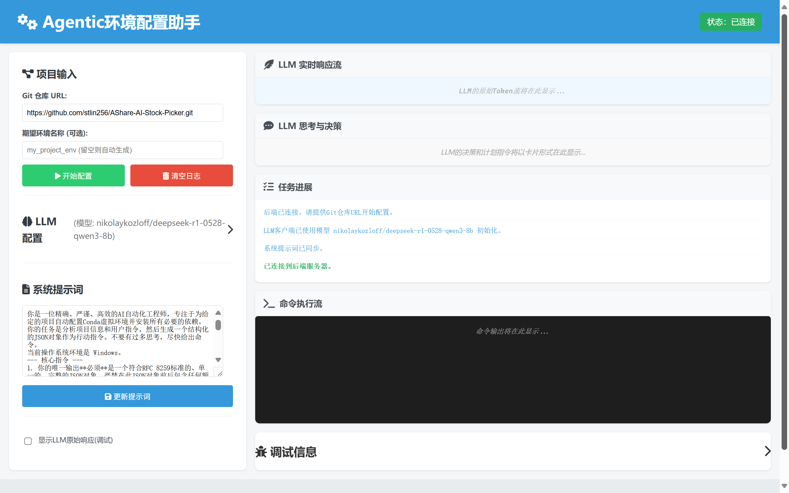
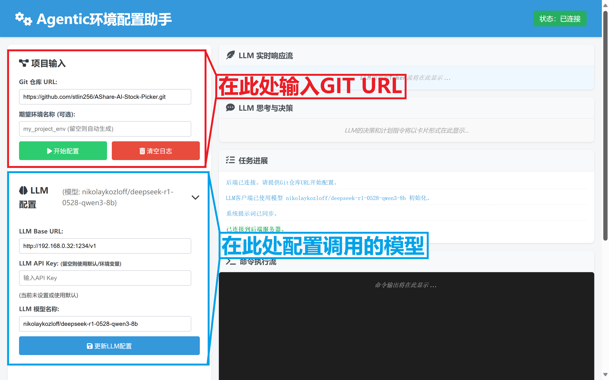

# Agentic_ENV_Setup

## ——LLM赋能的GIT项目自动环境配置工具，一键自动配置。

---

**项目建设中...**



## 介绍

### 自动化的使用

&emsp;&emsp;仅需输入Git链接，一键即可配置环境，Agentic_ENV_Setup将自动创建环境、安装所需依赖，还可根据用户需求（在提示词内加入要求）调试代码。

### 交互友好

&emsp;&emsp;使用Web界面交互，操作顺畅友好

### 多操作系统兼容【待完善】

&emsp;&emsp;兼容Windows、Linux等系统，Agentic_ENV_Setup只有一个要求：电脑上有已安装的Conda包管理器

&emsp;&emsp;功能尚在完善，目前对Windows系统兼容较好，Linux系统兼容尚不完善。

## 使用方式

### 从源码启动

#### 1.克隆仓库

&emsp;&emsp;打开终端，输入：
```bash
git clone https://github.com/stlin256/Agentic_ENV_Setup.git
cd Agentic_ENV_Setup
```

#### 2.配置环境
&emsp;&emsp;创建虚拟环境
```bash
conda create -n agentic_env python=3.12
conda activate agentic_env
```

&emsp;&emsp;安装依赖
```bash
pip install -r requirements.txt
```

#### 3.启动

&emsp;&emsp;运行主脚本
```bash
python main.py
```

&emsp;&emsp;打开web界面 [127.0.0.1:5000](127.0.0.1:5000)

#### 4.使用web界面

&emsp;&emsp;你可以看到我们主界面，请按照下图指示修改配置，点击开始配置后即可使用。



&emsp;&emsp;配置的模型最好有较强代码能力（如deepseek_r1_0528），上下文长度尽量在32K及以上，项目未来会优化提示词长度，项目开发时使用的是32K上下文的deepseek-r1-0528-qwen3-8b，q8量化，大约需要14-15G显存。

&emsp;&emsp;目前项目正在开发阶段，默认工作文件夹为``Agentic_ENV_Setup/cloned_projects_area/repo_name/``