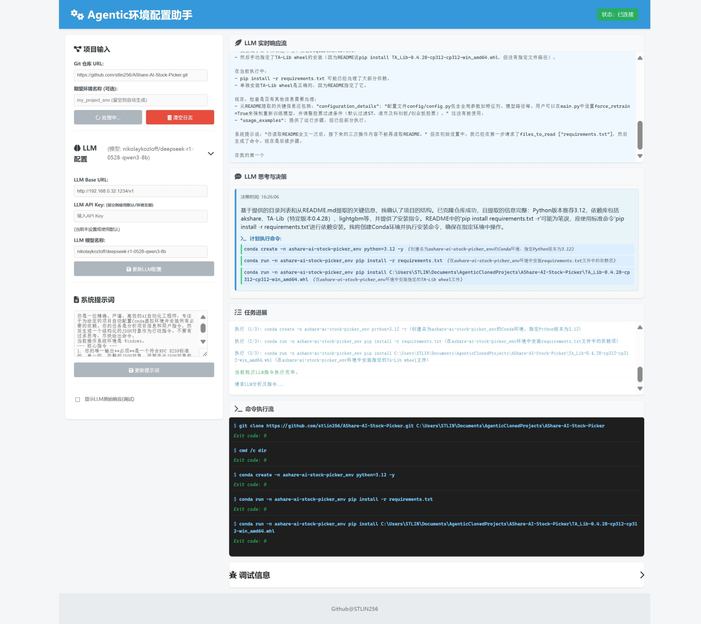

# Agentic_ENV_Setup

## ——LLM赋能的GIT项目自动环境配置工具，一键自动配置。

---

**项目建设中...**



## 介绍

一个某种意义上的“Agent”，用于GIT项目环境配置

众所周知的，当clone一个项目下来，配置环境的过程有时是令人恼火的，这也是为什么这个项目存在的原因

目前强兼容的是以python语言构建的项目，程序会试图创建并配置好一个Conda环境，甚至进行测试运行，当然，你的电脑上需要先配置好一个Conda。

### 自动化的使用

&emsp;&emsp;仅需输入Git链接，一键即可配置环境，Agentic_ENV_Setup将自动创建环境、安装所需依赖，还可根据用户需求（在提示词内加入要求）调试代码。

### 交互友好

&emsp;&emsp;使用Web界面交互，操作顺畅友好

### 多操作系统兼容【待完善】

&emsp;&emsp;兼容Windows、Linux等系统，Agentic_ENV_Setup只有一个要求：电脑上有已安装的Conda包管理器

&emsp;&emsp;功能尚在完善，目前对Windows系统兼容较好，Linux系统兼容尚不完善。

## 使用方式

### 从源码启动

#### 1.克隆仓库

&emsp;&emsp;打开终端，输入：
```bash
git clone https://github.com/stlin256/Agentic_ENV_Setup.git
cd Agentic_ENV_Setup
```

#### 2.配置环境
&emsp;&emsp;创建虚拟环境
```bash
conda create -n agentic_env python=3.12
conda activate agentic_env
```

&emsp;&emsp;安装依赖
```bash
pip install -r requirements.txt
```

#### 3.启动

&emsp;&emsp;运行主脚本
```bash
python main.py
```

&emsp;&emsp;打开web界面 [127.0.0.1:5000](127.0.0.1:5000)

#### 4.使用web界面

&emsp;&emsp;你可以看到我们主界面，请按照下图指示修改配置，点击开始配置后即可使用。


&emsp;&emsp;配置的模型最好有较强代码能力（如deepseek_r1_0528），上下文长度尽量在32K及以上，项目未来会优化提示词长度，项目开发时使用的是32K上下文的deepseek-r1-0528-qwen3-8b，q8量化，大约需要14-15G显存。

&emsp;&emsp;目前项目正在开发阶段，默认工作文件夹(windows系统下)为``~\Documents\AgenticClonedProjects\repo_name``，也就是文档文件夹内，Linux系统下为``home\AgenticClonedProjects\repo_name``

## 备注

如果配置时开始出现低质操作，可以尝试重新运行（需要删除原有工作目录）。~~可能是因为我的上下文管理和提示词工程的问题，程序一旦脑抽或者钻牛角尖，容易跳不出来。~~

## 已知问题

提示词长度管理逻辑混乱，长度过长内容太水，模型不好把握

任务进展卡片中不能展示模型写入文件的操作

再次对同一仓库操作时无法克隆文件


## 未来添加

#### 更完善的配置选项

&emsp;&emsp;自主调节工作目录

&emsp;&emsp;提示词快速构建（勾选构建/AI辅助生成提示词）

#### 增加更多工具，扩展Agent能力

#### 持久化设置选项和提示词保存

#### 更具效率和鲁棒性的提示词构建，减少Token开销

#### 一键启动的release包